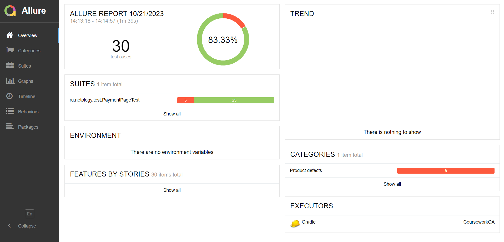

# Отчет по итогам тестирования

## Краткое описание

В данном проекте было проведено тестирование приложения для покупки тура при помощи сервиса платежей и кредитного сервиса.

## Количество тест-кейсов

В ходе тестирования было применено 30 тест-кейсов

## Процент успешных и не успешных тест-кейсов

Из 30 тест-кейсов:

* 25 (83,33%) успешных
* 5 (16,67%) не успешных

[В результате прогона тестов было составлено 5 баг-репортов и 2 предложения по улучшению](https://github.com/alvikui/CourseworkQA/issues)

## Общие рекомендации

* Создать документацию, описывающую требуемое поведение системы
* Исправить выявленные дефекты
* Исправить ошибку в названии города в промо-материале
* Добавить вывод номера заказа, после оплаты, для точной сверки в базе данных
* Возможно, была бы удобна опция сохранения данных в анкете при переключении между функциями "Купить" и "Купить в кредит". Сейчас анкета очищается каждый раз.